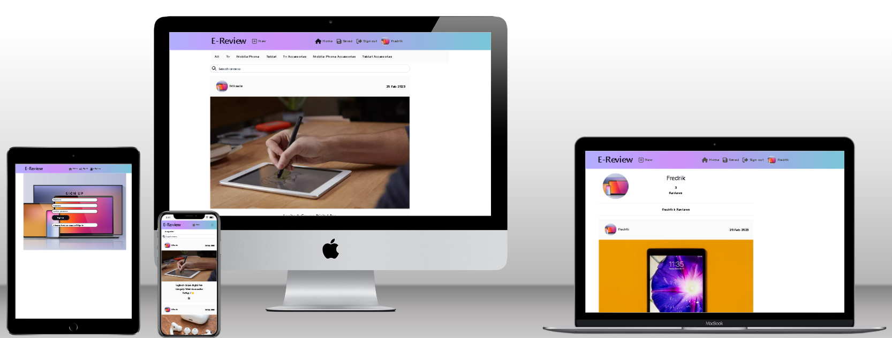
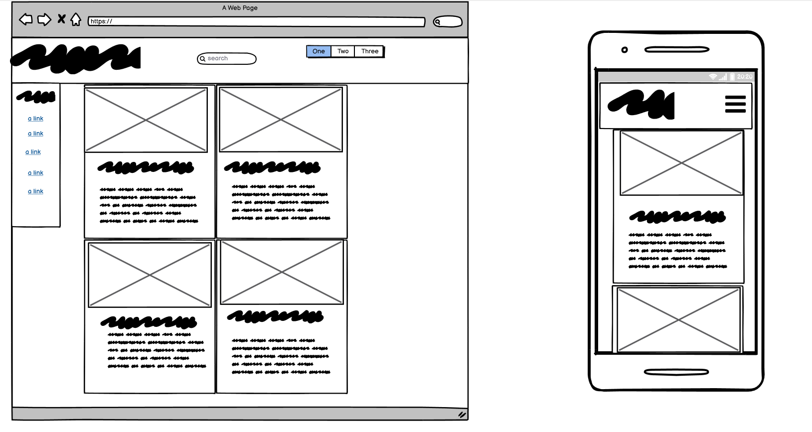
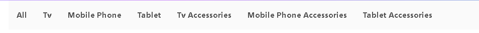
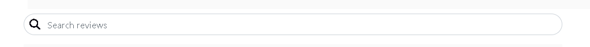
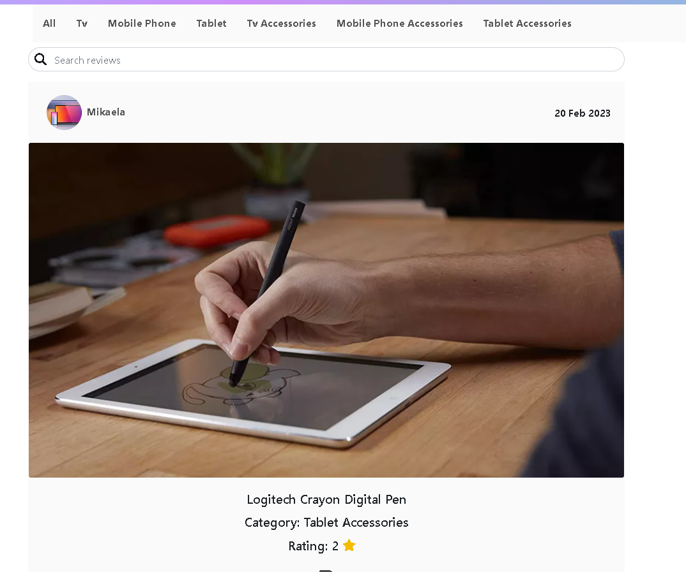
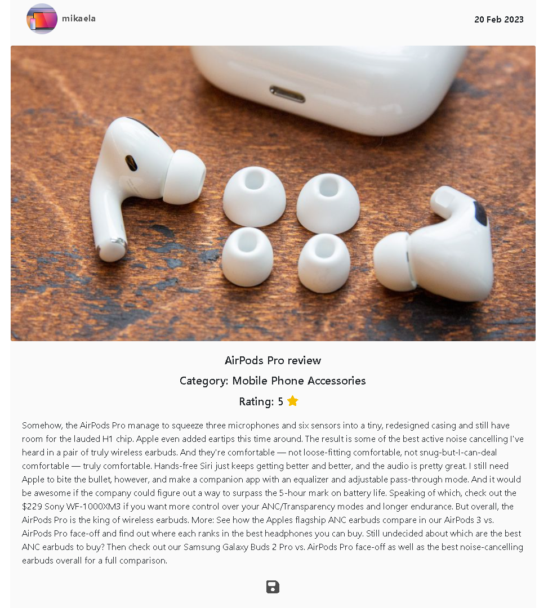

# **E-Review a review site for electronic products**

[E-Review Live Site](https://e-review.herokuapp.com/)



## **Introduction**
Welcome to E-Review a review site for electronic products. 
My fifth and last project for the Full Stack Web Developer Course.

This website goal is to help user's find reviews on products that they are interested in purchasing. 
Or for users that only want to browse reviews in its feed like layout. 

---

## **UXD - User Experience Design**
This project is planned for a user that wants to come to a site to browse reviews on various products, and see what other consumers really think about them.
I feel like it is a spot to fill where actual consumers reviews the products from a consumer perspective in a feed like manner for others to browse.


The project's planning is divided into 5 planes,

- The Strategy Plane
- The Scope Plane
- The Structure Plane
- The Skeleton Plane
- The Surface Plane
---

## **The Strategy Plane**

### **Navigation & Authentication**
- Navigation: As a user I can view a navbar from every page so that I can navigate easily between pages
- Routing: As a user I can navigate through pages quickly so that I can view content seamlessly without page refresh
- Authentication - Sign up: As a user I can create a new account so that I can access all the features for signed up users
- Authentication - Sign in: As a user I can sign in to the app so that I can access functionality for logged in users
- Authentication - Logged in Status: As a user I can tell if I am logged in or not so that I can log in if I need to
- Authentication - Refreshing access tokens: As a user I can maintain my logged-in status until I choose to log out so that my user experience is not compromised
- Navigation: Conditional rendering - As a logged out user I can see sign in and sign up options so that I can sign in/sign up
- Avatar: As a user I can view user's avatars so that I can easily identify users of the application

#### **Adding & Saving Reviews**
- Create a Review: As a logged in user I can create reviews so that I can share it to other consumers
- View a Review: As a user I can view the review to read more about what the reviewer thinks
- Save a post: As a logged in user I can save a review so that I can save it to easily find it again

#### **The Review Feed**
- View most recent reviews: As a user I can view all the most recent reviews, ordered by most recently created first so that I am up to date with the newest content
- As a user, I can search for reviews with keywords, so that I can find the reviews and user profiles I want to read more about.
- View saved reviews: As a logged in user I can view the reviews I saved so that I can find the reviews i liked the most
- Infinite scroll: As a user I can keep scrolling through the reviews on the site, that are loaded for me automatically so that I don't have to click on "next page" etc

#### **The Review Page**
- Review page: As a user I can view the review page so that I can read the comments about the post
- Edit Review: As a review owner I can edit my post title and description so that I can make corrections or update my review after it was created
- Create a comment: As a logged in user I can add comments to a review so that I can share my thoughts about the review
- Comment date: As a user I can see how long ago a comment was made so that I know how old a comment is
- View comments: As a user I can read comments on reviews so that I can read what other users think about the review
- Delete comments: As an owner of a comment I can delete my comment so that I can control removal of my comment from the application
- Edit a comment: As an owner of a comment I can edit my comment so that I can fix or update my existing comment

#### **The Profile Page**
- Profile page: As a user I can view other users profiles so that I can see all their reviews
- View all reviews by a specific user: As a user I can view all the reviews by a specific user so that I can read about other products that they have reviewed
- Edit profile: As a logged in user I can edit my profile so that I can change my profile picture
- Update username and password: As a logged in user I can update my username and password so that I can change my display name and keep my profile secure

---

## **The Scope Plane**

To be sure that my project was launched with a ready-to-use site I opted to divide the project into three phases.

**Phase 1**
- A project that would be good enough to use.
    - The feed page where users can find the reviews
    - The Navbar so that the users easily can navigate the page
    - New review so logged in users can make reviews
    - The ability to edit and delete reviews
    - Sign up and login function
    - Comment function so user can comment on reviews
    - The ability to edit and delete comments

**Phase 2**
- Building upon the Phase 1 project with additional features.
    - Profile page to display all the reviews of that user
    - Saved tabs so logged in users can save their favorite reviews
    - Feed filter to filter reviews into categories
    - Popups to validate before deletion of comments and reviews

**Phase 3**
- My final planned phase was to implement functionality that made it easier for the user(these are not yet implemented).
    - Sign up with social media accounts
    - Password recovery
---

## **The Structure Plane**

#### **Colors**
I opted for a multi colored navbar to give the site some more life. 

For the rest i went with rgb(18 16 25) Black with the #FAFAFA white as the contrast color to keep it easy on the eyes.


#### **Key Models**

**Review**
- This is the main model that lets the users create reviews
- Holds all the important information for the review
- It's connected to the imported user model

**Comment**
- This model holds the content for the comment
- It's connected to the review and user

**Keep**
- This model Save model is related to 'owner' and 'review'.
- Opted for rename it to Keep to not confuse it for the word save in the code.

**Profiles**
- Profile model related to "owner"
- Hold the username 

---

## **The Skeleton Plane**

This was my initial plan, however I made some adjustments as the project got farther along.
I tried to make the computer and mobile versions as similar as I could.

So, this is my initial project layout in its most basic form.


---

## **The Surface Plane**

### **Features**

*Features present across the project,*

**Navigation Bar**
- Navbar is implemented on every page and is fully responsive across all resolutions.
- Users can navigate across the site freely as long as they are signed in.


**Categorybar**
- The categorybar that lets the users filter the feed after categories.



**Searchbar**
- The searchbar that lets the users search for reviews or users



**The Feed**
- The feed if reviews that welcomes the users when they enters the site



**The Review Page**
- The review page, where users can read the review text and comment



**The Review Page**
- The review page, where users can read the review text and comment


## **Technologies Used**

- [Python](https://www.python.org/) 
    - asgiref==3.6.0
    - cloudinary==1.31.0
    - dj-database-url==1.2.0
    - dj-rest-auth==2.2.7
    - Django==3.2.17
    - django-allauth==0.52.0
    - django-cloudinary-storage==0.3.0
    - django-cors-headers==3.13.0
    - django-filter==22.1
    - djangorestframework==3.14.0
    - djangorestframework-simplejwt==5.2.2
    - gunicorn==20.1.0
    - oauthlib==3.2.2
    - Pillow==9.4.0
    - psycopg2==2.9.5
    - PyJWT==2.6.0
    - python3-openid==3.2.0
    - pytz==2022.7.1
    - requests-oauthlib==1.3.1
    - sqlparse==0.4.3

- [React](https://reactjs.org/)

- [JSX](https://reactjs.org/docs/introducing-jsx.html)

- [Cloudinary](https://cloudinary.com/)

- [HTML](https://developer.mozilla.org/en-US/docs/Web/HTML)

- [CSS](https://developer.mozilla.org/en-US/docs/Learn/Getting_started_with_the_web/CSS_basics)

- [React-Bootstrap](https://react-bootstrap.github.io/)

- [Google Developer Tools](https://developers.google.com/web/tools/chrome-devtools)

- [Github](https://github.com/)

- [Gitpod](https://www.gitpod.io/)

- [Balsamiq](https://balsamiq.com/)

- [Quillbot](https://quillbot.com/)

- [Grammarly](https://www.grammarly.com/)

- [Font Awesome](https://fontawesome.com/)

---

## **Testing**

Link to the Testing Document
- [TESTING.md](docs/TESTING.md)
---

## **Deployment**

**The DRF Repository**

The main branch of this repository is the most current version and has been used for the deployed version of the site.

The Code Institiue student template was used to create this project.

[Code Institute Full Template](https://github.com/Code-Institute-Org/gitpod-full-template)

- Click the *Use This Template* button.
- Give your repository a name, and description if you wish.
- Click the *Create Repository from Template* to create your repository. 
- Click the *Gitpod* button to create a gitpod workspace, this can take a few minutes.
- When working on project using Gitpod, please open the workspace from Gitpod, this will open your previous workspace rather than creating a new one.
Use the following commands to commit your work, 
- `git add . ` - adds all modified files to a staging area.
- `git commit -m "A short message exlaining your commit"` - commits all changes to a local repository.
- `git push` - pushes all your commited changes to your Github repository.


**Creating a Clone**

1. From the repository, click *Code*
2. In the *Clone >> HTTPS* section, copy the clone URL for the repository
3. In your local IDE open Git Bash
4. Change the current working directory to the location where you want the cloned directory to be made
5. Type `git clone`, and then paste the URL you copied in Step 2 -
6. Set the following values in a `env.py` file.
```
import os

os.environ.setdefault("SECRET_KEY", "<app secret key of your choice>")
os.environ.setdefault("DEVELOPMENT", "True")
os.environ["CLOUDINARY_URL"] = "cloudinary key"
```

7. Install the project requirements - `pip3 install requirements.txt`
8. Apply database migrations - `python manage.py migrate`
9. Create a superuser - `python manage.py createsuperuser`
10. The project can be run with the following - `python manage.py runserver`

**Heroku Deployment DRF**

1. Log into Heroku
2. Create a new app, choose a location closest to you
3. Make sure to have `dj_database_url` and `psycopg2` installed.
```
pip3 install dj_database_url
pip3 install psycopg2
```
5. Login to the Heroku CLI - `heroku login -i`
6. Run migrations on Heroku Postgres - `heroku run python manage.py migrate`
7. Create a superuser - `python manage.py createsuperuser`
8. Install `gunicorn` - `pip3 install gunicorn`
9. Create a requirements.txt file - `pip3 freeze > requirements.txt`
10. Create a `Procfile` (note the capital P), and add the following,
```
web: gunicorn moose_juice.wsgi:application
```
11. Disable Heroku from collecting static files - `heroku config:set DISABLE_COLLECTSTATIC=1 --app <your-app-name>`
12. Add the hostname to project settings.py file
```
ALLOWED_HOSTS = ['<you-app-name>.herokuapp.com', 'localhost']

```
13. Connect Heroku to you Github, by selecting Github as the deployment method and search for the github repository and pressing `connect`
14. In Heroku, within settings, under config vars select `Reveal config vars`
15. Add the following, 
```
DATABASE_URL =	<your database key here>
DISABLE_COLLECTSTATIC =	1 
SECRET_KEY = <your variable here>
```
16. Go back to the Deploy tab and under Automatic deploys choose `Enable Automatic Deploys`
17. Back in your CLI add, commit and push your changes and Heroku will automatically deploy your app
```
git add .
git commit -m "Initial commit"
git push
```
18. Your deployed site can be launched by clicking `Open App` from its page within Heroku.

**The React Repository**
1. Start a new repository from GitHub
2. Give your repository a name, and description if you wish.
3. Click the *Create Repository* to create your repository. 
4. Click the *Gitpod* button to create a gitpod workspace, this can take a few minutes.
5. When working on project using Gitpod, please open the workspace from Gitpod, this will open your previous workspace rather than creating a new one.
Use the following commands to commit your work, 
```
`git add . ` - adds all modified files to a staging area.
`git commit -m "A short message explaining your commit"` - commits all changes to a local repository.
`git push` - pushes all your commited changes to your Github repository.
```
6. Install React with the following code in the terminal 
```
npx create-react-app . --use-npm
```
7. Install React Bootstrap with the following code in the terminal
```
npm install react-bootstrap@1.6.3 bootstrap@4.6.0
```
**Heroku Deployment React**
1. Log into Heroku
2. Create a new app, choose a location closest to you
3. Make sure to add the following prebuild command into your package.json file in the "scripts" section
```
"heroku-prebuild": "npm install -g serve",
```
4. Add a Procfile at the root of the project with the following web command:
```
web: serve -s build
```
5. Make sure that you added the following config vars to your DRF project
```
CLIENT_ORIGIN = "Your React app URL"
```
6. Connect Heroku to you Github, by selecting Github as the deployment method and search for the github repository and pressing `connect`
7. Go back to the Deploy tab and under Automatic deploys choose `Enable Automatic Deploys`
8. Back in your CLI add, commit and push your changes and Heroku will automatically deploy your app
```
git add .
git commit -m "Initial commit"
git push
```
9. Your deployed site can be launched by clicking `Open App` from its page within Heroku.
---

## **Credits**

**Reviews**
- The existing reviews with pictures is taken from the following sites.
 - [rtings TV Review](https://www.rtings.com/)
 - [Ny Times Mobile Phone Review](https://www.nytimes.com/wirecutter/reviews/best-smartphones/)
 - [Ny Times Tablet Review](https://www.nytimes.com/wirecutter/reviews/best-tablets/)
 - [Tomsguide Apple TV](https://www.tomsguide.com/reviews/apple-tv-4k-2022/)
 - [Tomsguide Airpods](https://www.tomsguide.com/reviews/apple-airpods-pro/)
 - [Tomsguide Apple Pencil](https://www.tomsguide.com/buying-guide/best-apple-pencil-alternatives)

**Code**
- Base of the project is from the walkthrough projects in Code Institute Advanced Frontend Course.
    - Django REST Framework
    - Moments

