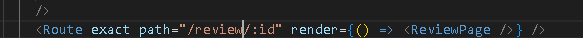

### **Manual Testing**

**Navigation Bar** 
- The navigation bar is fully responsive on large/medium/small resolutions.
- At smaller screens the navigation converts into a hamburger menu.
- All links are correctly redirecting to the correct pages. 
- Signing out, correctly shows the correct dropdown options, Log in and Register.
- Signing in, correctly shows the correct dropdown options, My profile, and Logout.

**Category Bar**
- The Category bar is fully responsive on large/medium/small resolutions.
- At smaller screens it converts into a dropdown with the header "Categories".
- All links successfully filters the reviews.

**The Feed**
- It correctly displays the new reviews in a feed with the newest first.
- The correct information is displayed.
- Clicking the review correctly redirects you to the review with more content.
- You can save or remove the save on the disk icon.
- The color changes on the save disc when you save or remove the saved review.
- The correct message appears when trying to save your own post.
- Clicking the username correctly redirects you to their profile.
- The correct date is displayed on the review.

**The Review Page**
- The correct information is displayed
- If you are the owner of the review the option dropdown correctly shows up, otherwise it's hidden. 
- You can delete or edit the reviews
- The edit review view correctly imports the existing information from the review
- Comments is correctly displayed in the order they are made with the newest first.
- You can edit or delete your own comments.

**The Profile Page**
- If you are at your own profile you can edit profile, change username or change password.
- If you visit another profile the option dropdown is hidden. 
- The count for how many reviews the user made is correct.
- All the reviews that the user have done is displayed in a feed with the newest first.

**Sign in/ Up Page**
- The correct error messages are displaying if the information in the fields are invalid or information are missed. 
- The redirects between login and sign up works correctly 

### **Validation**

[W3C HTML Validator](https://validator.w3.org/)
- No Errors

[W3C CSS Validator](https://jigsaw.w3.org/css-validator/)
- No Errors

[eslint JSX Validator](https://eslint.org/)
- No Errors

[Code Institute Python Validator](https://pep8ci.herokuapp.com/)

- All files created or modified by me where tested. 
- The following errors where found 

### **Bugs and Fixes**

**Bug1**
- After attempting to submit the form, I received a 400 bad request error in the console.
Even if a pre-populated option was present in the field, it wasn't recognized during submission because no changes had been made.

**Fix**
- Added a empty option before the first one. As a result, the default is an unfilled option that pushes the user to choose.

**Bug 2**
- Even though the url is correct and matches the path in app.js, the page cannot be found.
Everything was operational on the DRF side and it had previously functioned.

**Fix**
- Found a typo that occurred when trying to filter my saved reviews.
Missed a S at the end of review/:id 

**Bug 3**
- The filter function is working, but when reentering the feed page the filter is still there and the only way to remove it is to refresh the page.

**Fix**
- Added a relocate to the homepage with reload so filter was reseted

**Bug 4**
- Flexbox doesn't center content

**Fix**
- I found a extra empty column in my code that occupied half the screen

